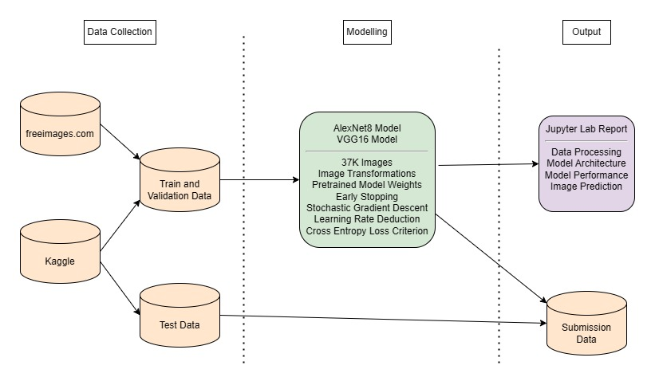
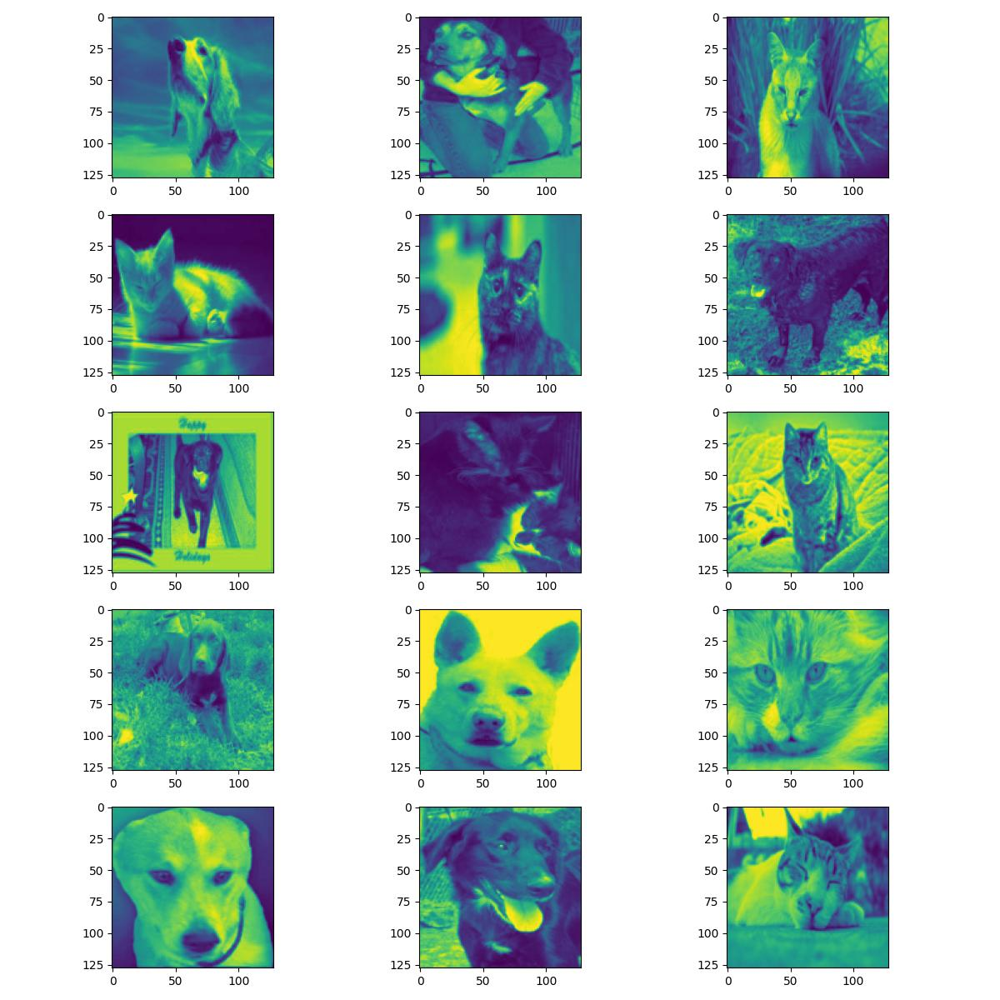
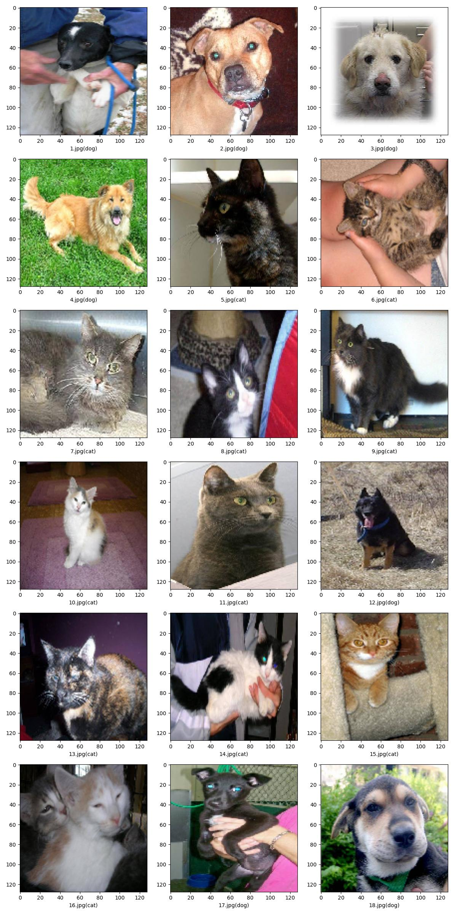

# Cat Classification

## Overview

This git repository contains code and configurations for implementing a Convolutional Neural Network to classify images containing cats or dogs. The data was sourced from the [dogs-vs-cats](https://www.kaggle.com/competitions/dogs-vs-cats/overview) Kaggle competition, and also from [freeimages.com](https://www.freeimages.com/) using a web scraper.

Two models were trained to classify the images; an AlexNet8 model via Keras and a VGG16 model via Torch.

Docker containers were used to deploy the application on an EC2 spot instances in order to scale up hardware and computation power. 



## Analysis Results

The images were further normalised using rotations, scaling, zooming, flipping and shearing prior to the modelling training phase.



Models were trained across 10 to 25 epochs using stochastic gradient descent and cross entropy loss. Learning rate reduction on plateau and early stopping were implemented as part of training procedure.



See the analysis results notebook for a further details on the analysis; including CNN architecture and model performance.

* https://nbviewer.org/github/oislen/CatClassifier/blob/main/report/torch_analysis_results.ipynb

Master serialised copies of the trainined models are available on Kaggle:

* https://www.kaggle.com/models/oislen/cat-classifier-cnn-models

## Running the Application (Windows)

### Anaconda

Create a local conda environment for the Cat Classifier app using [anaconda](https://www.anaconda.com/):

```
conda create --name CatClassifier python=3.12 --yes
conda activate CatClassifier
pip install -r requirements.txt
```

Execute the webscrapers and model training pipeline using the following commands and the local conda environment:

```
:: run webscrapers
python webscrapers/prg_scrape_imgs.py --run_download_comp_data --run_webscraper
:: run model training pipeline
python model/prg_torch_model.py --run_model_training --run_testset_prediction
```

The model training and evaluation report can be opened with:

```
jupyter lab --ip=0.0.0.0 --allow-root "report/torch_analysis_results.ipynb"
```
### Docker

The latest version of the Cat Classifier app can be found as a [docker](https://www.docker.com/) image on dockerhub here:

* https://hub.docker.com/repository/docker/oislen/cat-classifier

The image can be pulled from dockerhub using the following command:

```
docker pull oislen/cat-classifier:latest
```

The Cat Classifier app can then be started within a jupyter lab session using the following command and the docker image:

```
docker run --name cc --shm-size=512m --publish 8888:8888 -it oislen/cat-classifier:latest
```