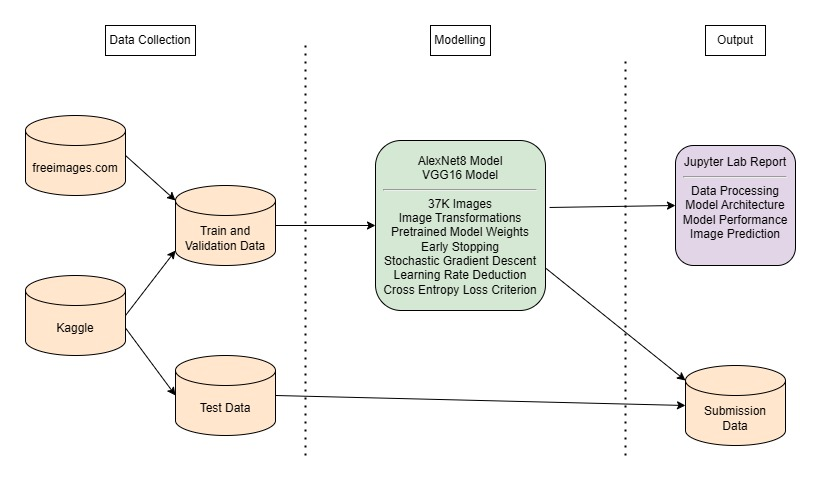
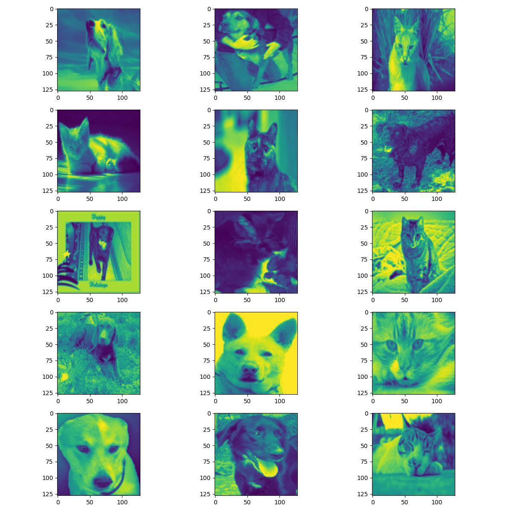
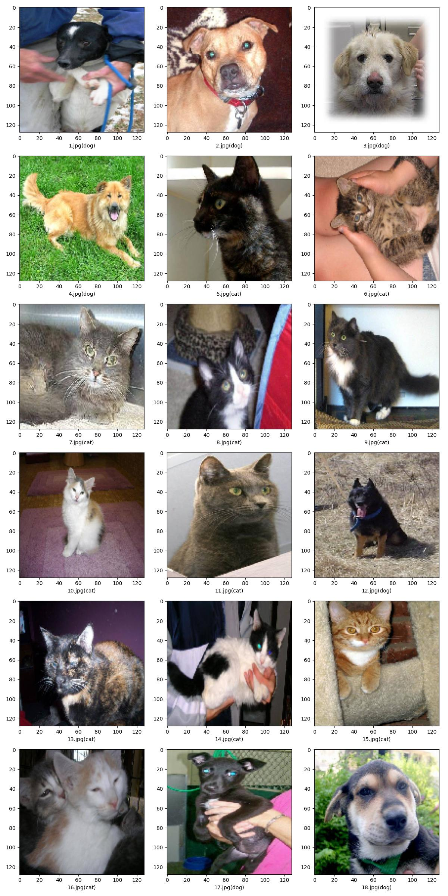

# Cat Classification

## Overview

This git repository contains code and configurations for implementing a Convolutional Neural Network to classify images containing cats or dogs. The data was sourced from the [dogs-vs-cats](https://www.kaggle.com/competitions/dogs-vs-cats/overview) Kaggle competition, and also from [freeimages.com](https://www.freeimages.com/) using a web scraper.

Three pretrained models were fine tuned to classify the images using PyTorch; AlexNet8, VGG16 and ResNet50.

Docker containers were used to deploy the application on an EC2 spot instances in order to scale up hardware and computation power. 



## Analysis Results

The images were further normalised using rotations, scaling, zooming, flipping and shearing prior to the modelling training phase.



The pretrained models were fine tuned across 10 epochs using stochastic gradient descent and cross entropy loss. Learning rate reduction on plateau and early stopping were implemented as part of training procedure.



See the analysis results notebook for a further details on the analysis; including CNN architecture and model performance.

* https://nbviewer.org/github/oislen/CatClassifier/blob/main/report/torch_analysis_results.ipynb

Master serialised copies of the fine tuned models are available on Kaggle:

* https://www.kaggle.com/models/oislen/cat-classifier-cnn-models

## Running the Application

### Docker

The latest version of the Cat Classifier app can be found as a [docker](https://www.docker.com/) image on dockerhub here:

* https://hub.docker.com/repository/docker/oislen/cat-classifier

The image can be pulled from dockerhub using the following command:

```
docker pull oislen/cat-classifier:latest
```

### Flask Rest API Endpoint

A Flask Rest API Endpoint can be started to classify images using the following command and the docker image:

```
docker run --name cc --gpus all --publish 5000:5000 --env PARAM_CHECK_GPU=True oislen/cat-classifier:latest
```

An exported Postman POST request example is available in the repo docs folder here:
* https://github.com/oislen/CatClassifier/tree/main/doc/CatClassifier.postman_collection.json

### Jupyter Lab Session

The Cat Classifier app can be started within a jupyter lab session using the following command and the docker image:

```
docker run --name cc --shm-size=512m  --entrypoint uv --publish 8888:8888 --gpus all --env PARAM_CHECK_GPU=True -it oislen/cat-classifier:latest run jupyter lab --ip=0.0.0.0 --allow-root --IdentityProvider.token='' --ServerApp.password=''
```

Once the Jupyter Lab session is running, navigate to localhost:8888 in your preferred browser

* http://127.0.0.1:8888/lab

Note, kaggle api credentials are required for pulling the training data from Kaggle.